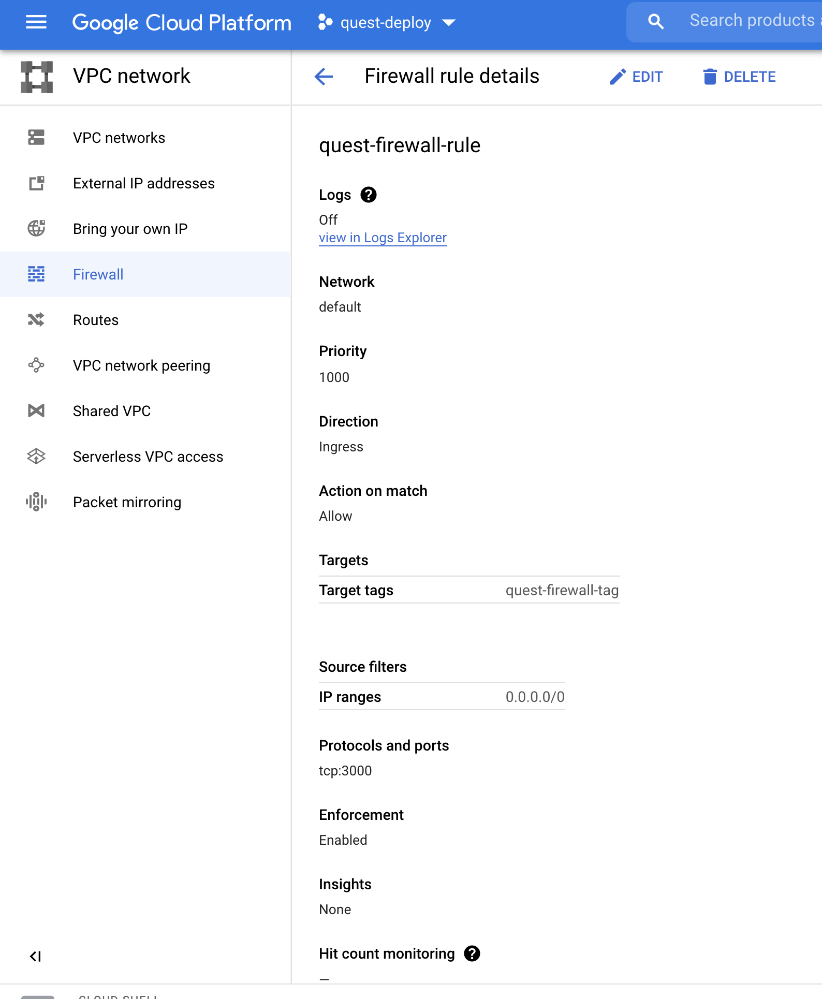

# A quest in the clouds - GCP deployment

This guide illustrates the steps to deploy the Quest Node.js app in an Autoscaleable Managed Instance group on GCP

## Table of Contents
* [Dockerizing the quest app](#Dockerizing the quest app)
* [Build and push the docker image:](#Build and push the docker image)
* [Creating a firewall rule:](#Creating a firewall rule)

### Dockerizing the quest app:

Create a Dockerfile in the app:

`vi Dockerfile`

The contents of this file are in the actual Dockerfile code. In a gist, create a Docker image for the app with node 10 as the base image, and expose it on port 3000. This is specified in the index file (src/000.js)

### Build and push the docker image:

Create a docker build and push it to gcp container registry. We are using a Cloud build to create this build on GCP:

`gcloud builds submit --tag gcr.io/<project-id>/docker-image .`

### Creating a firewall rule:

To allow traffic to our GCP VM instances, we create a simple firewall rule to allow traffic from public IP via port 3000.
Note that for this challenge, I've used default network available out of the box in every new GCP project

### Create managed instance group via instance template:

Create a Managed instance group in the default network, that deploys docker images with `latest` tag from the location `gcr.io/<project-id>/docker-image`
Once created, grab the `EXTERNAL_IP` of the instance and run the app using:

`http://<EXTERNAL_IP>:3000`

Refer the document for screenshots of output

### Create Load balancer:

---WIP---
